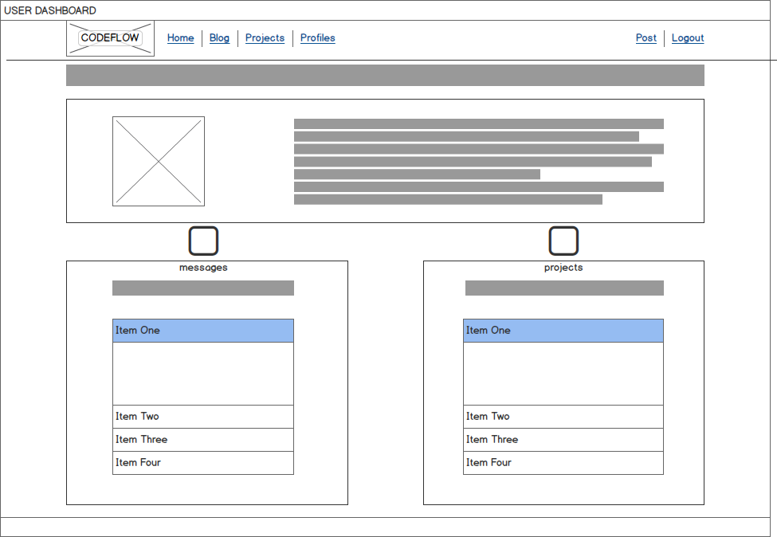
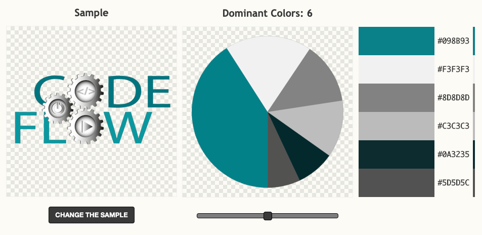
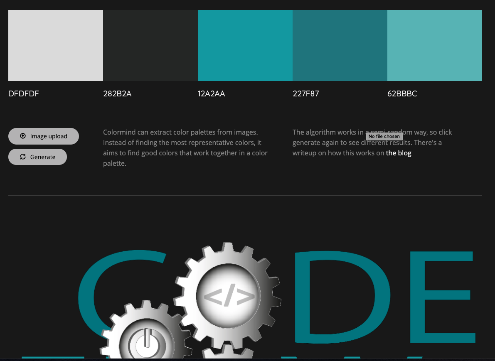
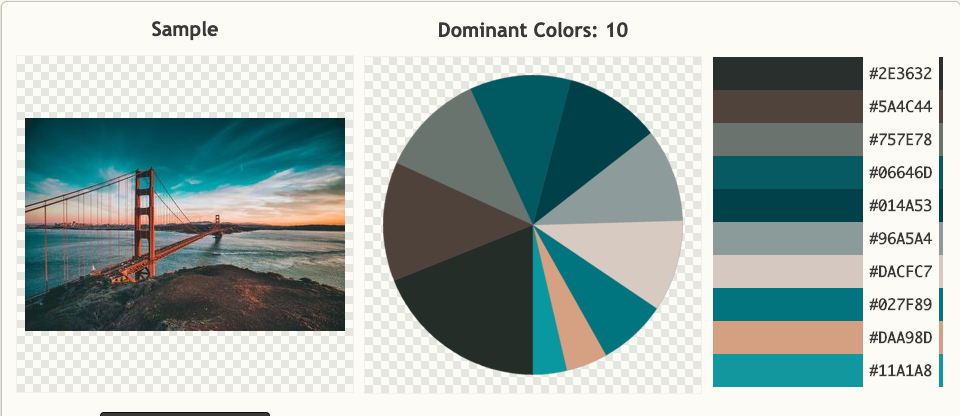
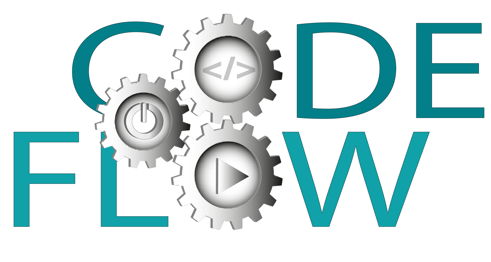
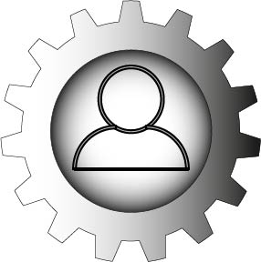

# MS3-project - CodeFlow

## Introduction

[CodeFlow](http://codeflow-app.herokuapp.com) was created to help bridge the gap to employed status for students. Based on the idea of the seasonal Hackathons held by Code Institute, where a brief is given and students collaborate to create finished projects, similarly, developers (or anyone with an idea) can upload projects that require full or partial contribution, called 'Piece projects' (derived from the term ['Piece work'](https://en.wikipedia.org/wiki/Piece_work)). The idea is that the more experience a student developer gains by collaborating in a team or from developing code snippets for real-world projects, the more skilled they become at breaking down project parts into smaller more manageable pieces or problems; thus resulting in a more confident developer who is naturally more appealing in the talent pool.

As a student, I find that describing and realising the whole-parts or 'pieces' of my projects is a challenging task and leaves me questioning how long it will take for me to become suitably experienced and/or skilled enough for employment within the industry of software developement. I would like exposure to others' projects and an opportunity to offer pieces of code I have written according to a brief to help me improve my skillset, increase speed and boost my confidence. I am certain that I am not alone and that the majority of software developer students, whether they are studying through an institution or self-teaching will find value in the same.

CodeFlow aims to provide a platform that makes it easy to keep track of the projects that any person/entity with a project or idea, be it project manager, developer, student or whomever, who would like to share it in part or whole with collaborators.

All 'noobs' are blessed when we can stand on the shoulders of giants and learn from more experienced developers/programmers. The CodeFlow Blog page is an area of the app that invites the community to post articles that impart knowledge or learning based on experience, interesting articles about new technologies, events, recommended books or courses or absolutely anything of relevance that benefits the readers.

## Table of Contents

1. [UX](#ux)

   - [Goals](#goals)

     - [Current Goals](#current-goals)
     - [Future Goals](#future-goals)
     - [Target Audience](#target-audience)
     - [User Goals](#user-goals)
     - [Future Goals](#future-goals)

   - [User Stories](#user-stories)

     - [Visitor Stories](#visitor-stories)
     - [User Stories by Type](#user-stories-by-type)
     - [Student](#student-also-referred-to-as-collaborator)
     - [Project Owner / Project Manager](#project-owner-or-project-manager-referred-to-as-project-owner)
     - [Mentor](#mentor)

   - [Design](#design)

     - [Wireframes](#wireframes)
       - [Desktop](#Ddesktop)
     - [Database Design](#database-design)
       - [Collections](#collections)
     - [User Interface](#user-interface)

2. [Features](#features)

   - [Exiting Features](#exisiting-features)

     - [Blog Page](#blog-page)
     - [Profiles Page](#profiles-page)
     - [Projects Page](#projects-page)
     - [User Dashboard](#user-dashboard)
     - [Direct Messages](#direct-messages)
     - [Piece Projects](#piece-projects)
     - [File Uploads](#file-uploads)
     - [ReCaptcha](#recaptcha)

   - [Future Features](#future-features)

     - [Keyword Search](#keyword-search)
     - [User Feedback Survey](#user-feedback-survey)
     - [Pagination](#pagination)
     - [User Ratings](#user-ratings)
     - [Message Notifications](#message-notifications)
     - [Email Authentication](#email-authentication)
     - [Task Automation](#automation-of-tasks)
     - [Database Housekeeping](#database-housekeeping)
     - [Slack Integration](#integration-with-slack)

3. [Technologies Used](#technologies-used)

   - [Languages](#languages)
   - [Frameworks/libraries](#frameworks/libraries)
   - [Database](#database)
   - [Devleopment and Hosting](#development-and-hosting)

4. [Testing](#testing)

5. [Deployment](#deployment)

   - [Local](#local-setup)
     - [Installation](#installation)
     - [Procedure](#procedure)
   - [Heroku](#deployment-on-heroku)
     - [Requirements](#requirements)

6. [Credits](#credits)

7. [Acknowledgements](#acknowledgements)

8. [Project Helpers](#project-helpers)

9. [Other Notes](#other-notes)

10. [Personal Takeways](#personal-takeawys)

## UX

### Goals

#### Current Goals

Create a platform that helps me and my peers on our journey towards employment as Software Developers and beyond.  
Acquire 'Domain' knowledge.  
Develop an application that is easy to use and meets the needs of the target audience and one which is aesthetically pleasing and intuitive to all users/visitors.  
Purposefully implement a database design suitable for the application.  
Become proficient at developing a Flask Web Application that successfully stores and retrieves data from a MongoDB database.  
Create a project plan that outlines my project idea and the elements required to complete it.
Learn additional material and develop a deeper understanding of the material already covered in the course.  
Produce a project that meets all the requirements of the MileStone Project criteria.
Produce a project that I am proud of.

#### Target Audience

Software Development Students (Bootcamp, College/University or self-teaching).  
Project Managers.  
Developers.  
Mentors.
Anyone/entity with a coding project.

#### User Goals

Have a community platform to:  
Post or find projects open for collaboration.  
Post or search profiles of users who are available to collaborate.  
Share useful and relevant content.  
Find articles and project helpers.  
Establish a reputation within the community.

#### Future Goals

In addition to the current goals:
A platform where hiring personnel search for potential candidates based on ratings.  
A site that is monetised via:  
Author's advertising their books and courses.  
Business' advertising their products/services/events.
Implement additional features that facilitate the above goals.

### User Stories

#### Visitor Stories

As a site visitor, I expect/want/need:
A responsive and intuitive site that helps me effectively achieve my goals.
Content to be separated into clearly distinguishable pages and sections and presented to me as per my current needs or actions taken.
Informative feedback on the actions I take when necessary or when there is a problem that prevents my actions from being successful.

#### User Stories By Type

##### Student (also referred to as collaborator)

As a student, I want a place to showcase my profile that highlights my skills to project owners and also indicate the types of projects I am interested in working on.
I want to be able to update my profile with new skills and languages as I progress.
I want to be able to find projects that are open for collaboration and a means to be able to express my interest directly to the project owner.
I want to be able to view any pieces that I have been given and their current status.
I want to be able to submit pieces once I have completed them and update their status.
I want to receive feedback on the work I have submitted.
I want a platform that provides a way for me to build up a reputation as a software developer.
I want a platform that I can read interesting articles directed at students software developers.

##### Project owner or project manager (referred to as project owner)

As an owner, I would like to have a way to connect with students that are looking for opportunities to collaborate on small projects.
I want to be able to see student profiles and be able to establish suitability for my projects.
I want a means to communicate with students directly regarding my projects and pieces I have created for them.
I want to be able to keep track of and check the status of all project pieces I have created.
I want to be able to update and delete my projects as necessary.

##### Mentor

As an experienced developer, I would like to be able to share helpful articles and content with students and the community in general, on a relevant platform.

## Design

The initial mockups and database design are included below. I found the need to change some of the design decisions during development, particularly for the user dashboard. Initially, I had planned on using accordions to display the content but realised that it was too heavy and changed to tabs because it was better suited to display so much content. This also meant I could separate the content even further and provide more real estate for each dashboard feature which was visually better from a readability perspective.

The Database Schema was the first task I started upon for the project which took a lot of time. I particularly wanted to get this part as close as possible to what I believed to be required for the app before starting to code. There was very little change required during development and I found this approach gave me a much better insight as to what was required for the project. I didn't need to include the category collection in the end.

### Wireframes

#### Desktop

As I was a implementing RWD methodology, I only created mockups for Desktop as, with the Bootstrap framework, a lot of the responsiveness is taken care of already. I decided during the development process how to structure elements for what I felt was the most optimal user view and experience across all screen sizes with the minimum of changes necessary. I based this decision on that fact that I believe that this application would be predominently accessed on a Desktop, when considering the User Types.

(Unable to display other mockups as they have been deleted accidentally)

### Database Design

The initial [Database Design](design/codeflow-schema.pdf "Title") was a constant reference point when creating forms and view functions and was invaluable. It would have been more difficult without it. It was worth the amount of time spent on it.

#### Collections

The app relies on a number of collections with documents having back references to the user collection.
Collections list

1. user
2. articles
3. article_comments
4. profiles
5. profile_msgs
6. languages
7. frameworks
8. projects
9. project_msgs
10. project_pieces

### User Interface

The colour scheme was derived from colours taken from the landing page image. I used a combination of [colormind.io](http://colormind.io/), [Adobe Color CC](https://color.adobe.com/) and [palettegenerator.com](https://palettegenerator.com/) to come up with a colour palette that I felt was complimentary to the app and the hero image.

I entered all the colour codes generated from the above into Adobe Color CC and used the 'color wheel' tab to find complementary colours and based my choices on my findings but not on the actual colour themes that were generated.

I used Adobe Illustrator to create the logo, default user image, and feature card icons for the home page.
  
  
  
  

## Features

### Existing Features

1. Blog page  
   The blog page is publicly accessible so anyone can read the articles that are posted. Only logged in users can post articles and comments, however. The feature is aimed to satisfy all user types as well as the community at large.

2. Profiles Page  
   Showcasing user-profiles - this page helps project owners find collaborators that they feel will be a suitable candidate for their projects. It provides a student user type with a place to present themselves and make known their interest and availability as a collaborator.

3. Projects Page  
   This page helps a project owner/manager user type present their projects to members that are a student user type. The project pieces form is accessed via this page and helps this user type to create piece projects for specific users.

4. User Dashboard  
   4.1 User Profile Image  
   This feature makes the platform a little more social. Profile images will be linked to user posts in the next sprint facilitating familiarity between users based on the notion that an image is more easily recognised than a username. The images are stored in a S3 bucket, renamed with the user's username, converted to jpg and saved as a string in the database. This means that only one profile image is saved per user account.  
   4.2 All User Content  
   The Dashboard is the place where users will find all their content, either created by them or sent to them. They can edit and delete their content here. This helps both owner and student user type manage and keep track of their content and commitments.

5. Direct Messages  
   This feature helps both owner and student user type with their need to communicate regarding collaboration and projects. Direct messages are sent via the profiles or projects page but are only displayed to users on their dashboard. This feature enables private, P2P communication between the relevant parties. Having the DM's in the user's dashboard, separated between sent and received messages, means users can find and respond more quickly to invitations and requests as well as acting as a store of messages they have sent. This exposes messages that have not received a response.

6. Piece Projects  
   This feature was the main feature that I wanted to implement as it provides a way for a project to be shared and managed. Breaking a project up and sharing it between several collaborators would be very challenging without a means of keeping track. The project pieces are listed in the various stages of the lifecycle, namely:  
   Pending Acceptance:- pieces that have been created for a collaborator but not yet accepted.
   Accepted:- pieces that have been accepted by a collaborator indicating their intention to complete and submit the work.  
   Pending Approval:- pieces that have been completed and submitted but not yet accepted by the project owner.  
   Closed:- pieces that have been accepted will have their status changed to closed.

   As the pieces are listed on the page according to their status, both owner and collaborator can easily keep track of the active pieces.

7. File uploads  
   File uploads assist both owner and collaborator types with the projects. It helps owner user types the to provide additional information about their project and collaborator user types to submit completed pieces.
8. ReCaptcha:
   A ReCaptcha widget was implemented to help protect the app from spam and other abusive actions and helps prevent bots from being able to register accounts. It is used for registering an account and for updating passwords or uploading profile images and files. This feature helps to provide a measure of comfort for all user types that the content they are accessing has been created by a real person.

### Future Features

1. Keyword Search:  
   while this is a very useful feature, it is currently listed for the second sprint which I intend to implement soon, particularly if I see that the application is being used and it becomes a necessity.

2. User Feedback Survey:  
   I would like to have this feature as a button on the landing page to learn how to improve the app for users. This feature provides market research than can only be gained if users are actively accessing and using the application.

3. Pagination:  
   Again, this is a feature that would be useful to have when enough content has been created and is easily implemented.

4. User ratings (votes) - to build up a reputation for collaborators:  
   This feature will be very beneficial to the student user type as it would serve as a verification/reference of collaboration and also to Hiring managers and the owner user type when considering requests for pieces while viewing profiles.

5. Message notifications:  
   This feature would be great to implement as it would help users know that they have received messages when they log in and perhaps be a motivator for users to log in if notifications are sent via email.

6. Email authentication:  
   Currently, there is email address validation but this is definitely something that I would change on the next sprint and use JWTokens.

7. Automation of tasks:  
   For instance, when the status of a particular project piece is changed, the referenced piece in the project document gets updated as well. This is something I will need to figure out and would make for a more user-friendly application requiring less user management.

8. Database Housekeeping:  
   Implementing an expiry on 'closed' project pieces will help to maintain a clean database. This would require much more than I am capable of currently but something that is very necessary. Having the task automated via MongoDB would be the most ideal method. (Since implementing file uploads to AWS s3, this feature is no longer required as the removal has, to an extent, been passed to the project owners discretion on the dashboard Sent Pieces 'closed pieces' section, however, the bucket objects can have an expiry placed upon them and this is now the intention going forward, instead).

9. Integration with Slack:
   Considering the nature of the app, once I can figure out how to make it a useful feature to implement for project owners, I would like to include this a feature.

## Technologies Used

### Languages

1. [HTML](https://html.spec.whatwg.org/)
2. [CSS](https://www.w3.org/Style/CSS/Overview.en.html)
3. [JavaScript](https://www.javascript.com/)
4. [Python](http://python.org/)

### Frameworks/Libraries

1. [Bootstrap v4.5](https://getbootstrap.com/)
2. [Flask](https://palletsprojects.com/p/flask/)
3. [jQuery](https://jquery.com/)
4. [jQUery UI](https://jqueryui.com/)

### Database

[MongoDB](https://www.mongodb.com/)

### Development Tools and Hosting

1. [Visual Studio Code](https://code.visualstudio.com/download)
2. [Git](https://git-scm.com/)
3. [GitHib](https://github.com/)
4. [Heroku](https://www.heroku.com/)
5. [AWS S3](https://aws.amazon.com/s3/)
6. [Google ReCaptcha v2](https://developers.google.com/recaptcha/docs/display)

## Testing

Testing has been carried out continuously throughout the development lifecycle. With each feature addition or update, testing and retesting was done from different user accounts that were purposefully created for testing and sending data between different user accounts.

User testing and feedback was also provided by family and friends in different regions using a variety of devices and browsers at various stages of development.

Personal Findings:  
Mobile browsers provide a different perspective and the buttons appear differently on each of them and in some cases, they are not uniform even on the same browser.  
Checking Chrome dev tools for mobile rendering provided a very inaccurate representation.

## Deployment

### Local setup

To install this project to run on a local machine the following steps are required:

#### Installation

Ensure the following is installed

1. [Python 3.7](https://www.python.org/downloads/)
2. [PIP](https://pip.pypa.io/en/stable/installing/)
3. [pipenv](https://pypi.org/project/pipenv/) (recommended) or [venv](https://docs.python.org/3/library/venv.html)
4. [Git](https://git-scm.com/)
5. MongoDB Compass; otherwise MongoDB Atlas can be used (an account is required for either). See [MongoDB](https://www.mongodb.com/) for documentation, information and to learn about using a Python driver such as Pymongo to connect your app with the database and the commands used to perform operations on the database.

#### Procedure

1. Find the [repository](https://github.com/SPH73/codeflow) on GitHub and either save a copy of the repository locally to your chosen folder in your local file system by clicking the green code download button and choosing 'Download ZIP' and extracting the zip file or using Git to [clone this repository](https://github.com/SPH73/codeflow.git) the link is also found within the same button on the repository page.
2. Open a terminal either in your code editor or the one installed on your machine to unzip the download or use the command `git clone https://github.com/SPH73/codeflow.git`.
3. Setup your virtual environment. I recommend using pipenv but venv otherwise - refer to the links provided in the installation section on how to use pipenv and venv for your operating system.
4. To use pipenv to install using the Pipfile change into the directory you are using for the application and use the command `pipenv install` or if using pip then use the command `pip -r requirements.txt`. Both methods install all the required modules to run the application.
5. Run `pipenv shell` to activate the virtual environment,  
   `exit` to deactivate  
   `pipenv update --outdated` to find out if there are any changes in the packages or  
   `pipenv update` to upgrade them all.
6. Create files to serve your environment variables for the application **_please note that these should NOT be pushed to your repository but stored in a `.gitignore` file_**.
   Create `.flaskenv` to set the flask environment variables as follows:
   FLASK_ENV=development
   FLASK_APP=run.py
   TESTING=True
   You will change these for a production environment.

   Create `.env` store your own keys as follows:
   SECRET_KEY = 'yoursecretkey'

If you are using a google recaptcha (link in Technologies section)
RECAPTCHA_PUBLIC_KEY = 'yoursecretkey'
RECAPTCHA_PRIVATE_KEY = 'yoursecretkey'

Obtained from your mongodb database under 'Connect'
MONGO_URI = "yourconnectionstring"

If you are storing file uploads in an AWS S3 bucket (link in Technologies section)  
S3_BUCKET=yourbucketname  
AWS_ACCESS_KEY_ID=yourawsaccesskey  
AWS_SECRET_ACCESS_KEY=yourawssecretaccesskey

The application should run successfully once the above instructions have been completed.

### Deployment on Heroku

#### Requirements

A Heroku account  
An app created on Heroku - click on 'New' and 'Create new app' to create an app with a unique name and specify the region.  
Within the app select the 'Deploy' tab, select GitHub as the deployment method and choose automatic deploys from master.  
Under the 'Settings tab, click on 'Reveal Config Vars' and add your environment configuration variables as the KEY and the values as the VALUE.  
Add in IP: 0.0.0.0 and PORT: 5000 in addition to the variables listed above.

Within your application files, Heroku requires:  
`Pipfile` if using PIPENV - you will need to pin the versions of the package for deployment (please take some time to learn about [pipenv](https://pipenv-fork.readthedocs.io/en/latest/basics.html)), otherwise, a requirements file is needed. Update the requirements file by running the command `pip freeze > requirements.txt`  
Create a `Procfile` using the command `echo web: python run.py`, which tells Heroku how to run the application.

Completing the above steps should result in your site being deployed successfully.

Inspect the logs if there are any problems that result in a 500 error. Logs are found under Settings and clicking on 'More' then 'View logs' to see where the error is.

## Credits

Hero image - Photo by Joseph Barrientos on Unsplash
Bridge Top - Photo by Joshua Sortino on Unsplash
[CSS code for Recaptach resizing for mobile screens by GeekGodess](https://geekgoddess.com/how-to-resize-the-google-nocaptcha-recaptcha/)

The script and function to get the file size before upload was taken from [pythonise.com](https://pythonise.com/series/learning-flask/flask-uploading-files) as I had been unsuccessful in consistently getting the filesize before saving the file. Some browsers do not send content.length information and this was a better solution.

## Acknowledgements

Special thanks to the following individuals for without their help I might still be struggling along:  
Brian Macharia - mentor for supporting through this journey and for helping me get the SelectMultipleField option working in my profile form.  
To Haley Shafer for helping me debug the project messages route function during a screen share session and extra thanks for finding an alternative method of screen share when the slack option wasn't working;  
to Michael Parks for helping me understand why some content on the dashboard wasn't rendering and suggesting a way to achieve it;  
to IgorB (data-centric channel lead at the time) for spotting an error on the user 'pieces' loops on the dashboard feature and  
to Simen (@Eventyret_mentor) for giving me a showing me a method of getting an element ID in a loop.

I am also very grateful to my children and friends for their patience and understanding of my absence and lack of time during the development of this project.

## Project Helpers

This is a list of resources I used for the project. It is by no means exhaustive but added for the benefit of other students and as a personal reference during development.

[pipenv](https://pypi.org/project/pipenv/) was used to create a virtual environment. It is the recommended python virtual environment management according to the official docs.  
[Python secret key generator](https://docs.python.org/3/library/secrets.html) generated in the python repl using `secrets.token_hex(16)`, which is designed for security and cryptography and returns a random text string in hexadecimal using the os and secrets module.  
[Flask](https://flask.palletsprojects.com/en/1.1.x/)  
[Flask tutorial](https://hackersandslackers.com/series/building-flask-apps)  
[flask-wtf](https://flask-wtf.readthedocs.io/en/stable/quickstart.html)  
[Wtforms](https://wtforms.readthedocs.io/en/2.3.x/)  
[File uploads](https://flask.palletsprojects.com/en/1.1.x/patterns/fileuploads/)  
[Recaptcha Tutorial](https://pusher.com/tutorials/google-recaptcha-flask)  
[Google reCAPTCHA Tutorial](https://codelabs.developers.google.com/codelabs/reCAPTCHA/index.html#5)  
[Flask_PyMongo Docs](https://flask-pymongo.readthedocs.io/en/latest/)  
[Flask-Pymongo](https://www.bogotobogo.com/python/MongoDB_PyMongo/python_MongoDB_RESTAPI_with_Flask.php)  
[Flask deployment options](https://flask.palletsprojects.com/en/1.1.x/deploying/?highlight=deploying)  
[Deploying to Heroku](https://medium.com/technest/build-a-crud-app-with-flask-bootstrap-heroku-60dfa3a788e8)  
[Favicon-generator](https://www.favicon-generator.org/)
[TextEditor](https://flask-ckeditor.readthedocs.io/en/latest/basic.html)
[Date Picker Widget](https://api.jqueryui.com/datepicker/#method-widget)
[Python Pillow Package](https://pillow.readthedocs.io/en/stable/)
[Flask Project Structure Best Practices](https://exploreflask.com/en/latest/organizing.html)
[boto3](https://buildmedia.readthedocs.org/media/pdf/boto3/latest/boto3.pdf)
[jinja filters](https://docs.exponea.com/docs/filters)

#### Other Notes

I updated the project structure by turning the application into a package with `__init__.py` and moving the routes to `routes.py`. To avoid confusion I renamed `app.py` to `run.py` to be different from the package name. At the same time I created a `requirements.txt` to be inclusive of choice/preference for other developers, deployment and the assessors.

#### Personal Takeaways

Throughout developement, I noticed that I regularly jumped around instead of completing each part before tackling another. As a goal for my next project, I want to work on this area. I believe it will actually help me to take less time to complete projects and make fewer mistakes.
